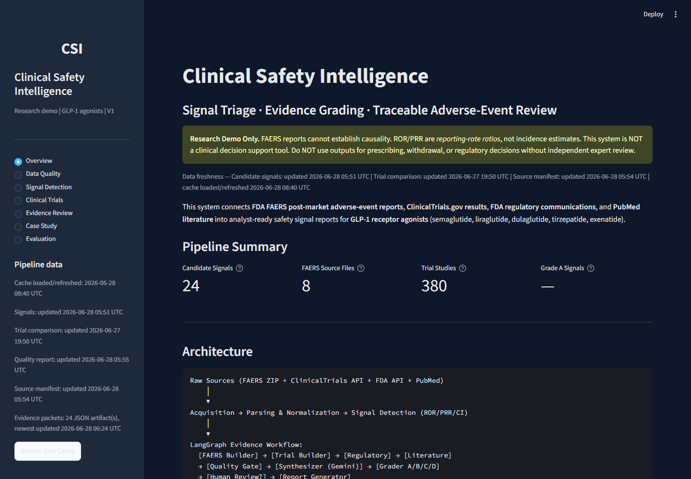
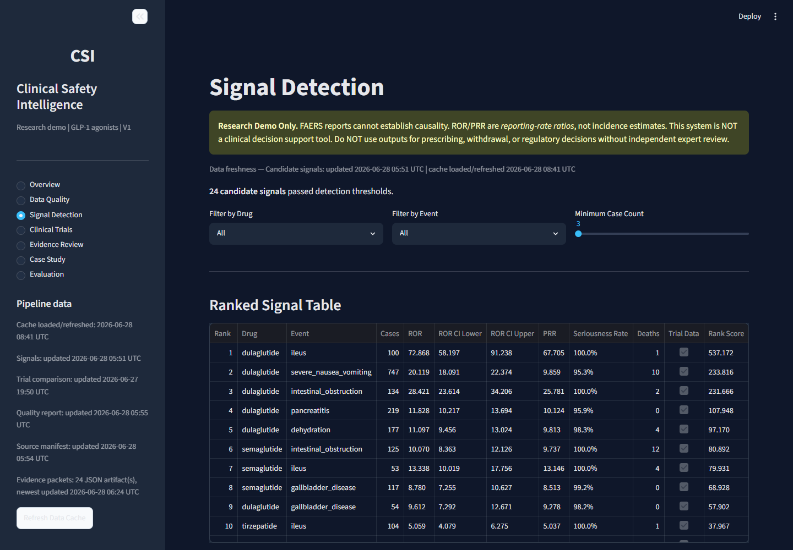
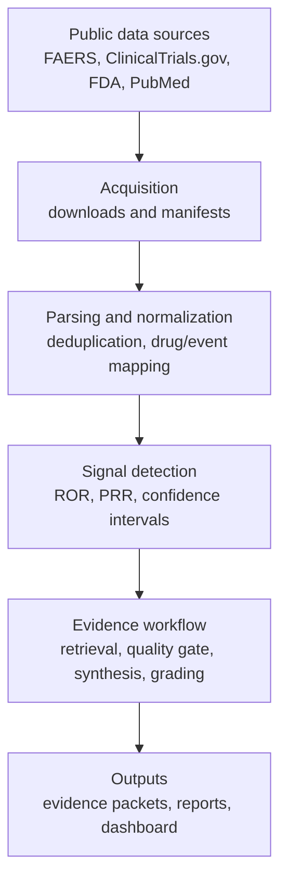

# Clinical Safety Intelligence

Clinical Safety Intelligence is a Python project for analyzing drug safety signals in public pharmacovigilance data. It focuses on GLP-1 receptor agonists and gastrointestinal adverse-event families, then combines FAERS signal detection with trial, regulatory, and literature evidence.

The goal is not to make clinical decisions. The goal is to show a reproducible data and AI workflow for safety-signal triage: acquire public data, normalize messy source records, rank candidate signals, retrieve supporting evidence, synthesize findings with guardrails, and present outputs in an analyst dashboard.

## What It Does

- Downloads or reads configured FAERS/AEMS quarterly data.
- Normalizes drug names, adverse-event terms, outcomes, and report roles.
- Computes disproportionality metrics including ROR, PRR, confidence intervals, seriousness, and candidate signal ranking.
- Optionally enriches signals with ClinicalTrials.gov adverse-event results.
- Retrieves FDA label, FDA safety communication, and PubMed evidence.
- Runs a LangGraph workflow for evidence quality checks, Gemini synthesis, grading, and report generation.
- Serves generated outputs through a Streamlit dashboard.

## Technical Highlights

- End-to-end public-data pipeline: acquisition, parsing, normalization, signal ranking, evidence retrieval, and dashboard presentation.
- FAERS-specific data handling: report deduplication, primary-suspect filtering, seriousness outcomes, and source manifests.
- Statistical signal detection: 2x2 contingency tables, ROR/PRR, confidence intervals, benchmark checks, and weak-control monitoring.
- Evidence synthesis workflow: LangGraph state machine, deterministic quality gates, Gemini synthesis, guardrails, and reproducible evidence packets.
- Traceable outputs: Streamlit dashboard, Markdown reports, benchmark snapshot, and documented limitations.

## Scope

| Area | Current scope |
|:---|:---|
| Drug class | GLP-1 receptor agonists |
| Drugs | semaglutide, liraglutide, dulaglutide, tirzepatide, exenatide |
| Event families | pancreatitis, gallbladder disease, ileus, gastroparesis, intestinal obstruction, severe nausea/vomiting, dehydration, hospitalization |
| Primary data | FDA FAERS/AEMS quarterly public data |
| Evidence sources | ClinicalTrials.gov, FDA labels/safety communications, PubMed |

Source details: [docs/data_sources.md](docs/data_sources.md)

## Dashboard Preview

Overview:



Signal ranking:



## Important Limitations

This project supports safety-signal triage and analyst review. It does not establish causality and is not intended for clinical decisions, prescribing guidance, regulatory submissions, or automated drug safety actions.

- FAERS/AEMS reports are spontaneous reports and cannot establish causality.
- Disproportionality metrics are reporting-rate measures, not incidence or patient risk estimates.
- LLM-generated synthesis can omit or misinterpret evidence and must be manually reviewed.
- Clinical trial enrichment depends on posted results and inconsistent adverse-event terminology.
- Evaluation metrics are engineering checks, not clinical or regulatory validation.

More detail: [docs/limitations.md](docs/limitations.md)

## Architecture



Detailed architecture: [docs/architecture.md](docs/architecture.md)  
Evidence workflow: [docs/langgraph_workflow.md](docs/langgraph_workflow.md)

## Local Setup

```bash
cd clinical-safety-intelligence
python3 -m venv .venv
source .venv/bin/activate
python3 -m pip install -e ".[dev]"
python3 -m clinical_safety.init_env
```

`clinical_safety.init_env` creates `.env` from `.env.example` when needed and prepares local data directories. It does not fill secret values.

Set `GEMINI_API_KEY` in `.env` for real Gemini synthesis. `NCBI_API_KEY` is optional and increases the PubMed request allowance.

## Run the Pipeline

Minimal FAERS signal pipeline:

```bash
python3 -m clinical_safety.acquisition.faers_source
python3 -m clinical_safety.analytics.signal_ranking
python3 run_evidence_workflow.py
```

Optional ClinicalTrials.gov enrichment before ranking:

```bash
python3 -m clinical_safety.acquisition.clinicaltrials_source
python3 -m clinical_safety.modeling.trial_comparator
python3 -m clinical_safety.analytics.signal_ranking
```

Dry-run mode runs the workflow without Gemini calls and writes placeholder synthesis text:

```bash
python3 run_evidence_workflow.py --dry-run
```

Resume an interrupted LLM run without rerunning existing real packets:

```bash
python3 run_evidence_workflow.py --resume
```

Override the configured Gemini model for a single run:

```bash
python3 run_evidence_workflow.py --model gemini-2.5-flash
```

Start the dashboard after generating pipeline outputs:

```bash
streamlit run src/clinical_safety/app/streamlit_app.py --server.address 127.0.0.1
```

More run details: [docs/running.md](docs/running.md)

## Outputs

Generated outputs are local runtime artifacts and are excluded from version control:

- `data/processed/signals/` candidate signal tables
- `data/processed/evidence_packets/` structured evidence packets
- `data/processed/reports/` Markdown reports
- `data/processed/analytics/evaluation_results.json` evaluation metrics

## Evaluation

The project includes an engineering benchmark against curated known-positive and weak-control drug-event pairs:

```bash
python3 -m clinical_safety.evaluation.runner
```

The benchmark is useful for checking signal-ranking behavior, but it is not clinical validation.

More detail: [docs/evaluation.md](docs/evaluation.md)  
Example output: [docs/results.md](docs/results.md)

## Repository Guide

| Path | Purpose |
|:---|:---|
| `src/clinical_safety/acquisition/` | FAERS, ClinicalTrials.gov, and source-manifest ingestion |
| `src/clinical_safety/normalization/` | Drug, event, and outcome normalization |
| `src/clinical_safety/analytics/` | Contingency tables, disproportionality metrics, ranking |
| `src/clinical_safety/evidence/` | FDA and PubMed retrievers |
| `src/clinical_safety/orchestration/` | LangGraph evidence workflow and grading |
| `src/clinical_safety/app/` | Streamlit dashboard |
| `configs/` | Data source, scope, threshold, and model settings |
| `docs/` | Supporting architecture, data-source, evaluation, and run notes |

## Stack

Python, Pandas, SciPy, Pydantic, LangGraph, Google GenAI/Gemini, Streamlit, and Plotly.
