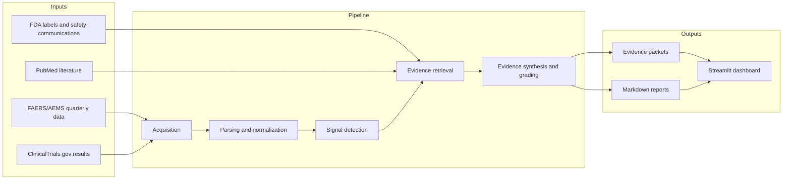

# Architecture

Clinical Safety Intelligence is organized as a batch pipeline plus an analyst dashboard. The pipeline turns public adverse-event and evidence sources into ranked drug-event signals, evidence packets, and Markdown reports.

## Layers

1. **Acquisition** downloads configured public sources and writes source metadata.
2. **Parsing and normalization** converts raw files to tabular data, deduplicates FAERS reports, and maps drug and event terms.
3. **Signal detection** computes disproportionality and trend metrics, then creates a ranked shortlist.
4. **Evidence retrieval** collects regulatory, label, literature, FAERS, and optional trial context for selected signals.
5. **Evidence synthesis** runs the LangGraph workflow for quality checks, LLM synthesis, deterministic grading, and report generation.
6. **Presentation** reads processed outputs for the Streamlit dashboard and exported reports.

## Boundaries

- Data acquisition and processing are batch-oriented.
- The dashboard reads generated outputs; it does not replace the pipeline.
- LLM synthesis is isolated to the evidence workflow.
- Dry-run mode replaces Gemini synthesis text only; it does not create review-ready evidence.

See [langgraph_workflow.md](langgraph_workflow.md) for the evidence workflow graph.
