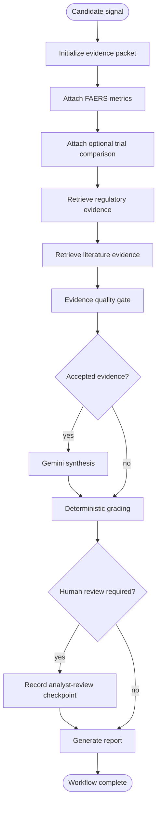

# LangGraph Workflow

`src/clinical_safety/orchestration/graph.py` builds the evidence workflow for one ranked drug-event signal. Upstream signal ranking selects candidate rows; `run_signal(drug_id, event_id, ...)` initializes graph state and invokes the compiled workflow for one row.

## State

`SafetyIntelligenceState` carries:

- signal identity: `drug_id`, `event_id`, and `evidence_window`
- the current `EvidencePacket`
- optional filesystem `Paths`
- collected `errors`
- `workflow_complete`
- `human_review_required`

## Nodes

1. `candidate_signal_selector` initializes the packet shell and labels.
2. `faers_evidence_builder` attaches FAERS signal metrics.
3. `trial_evidence_builder` attaches optional ClinicalTrials comparison data.
4. `regulatory_evidence_retriever` retrieves FDA label and safety-communication evidence.
5. `literature_evidence_retriever` retrieves PubMed evidence.
6. `evidence_quality_gate` accepts or rejects external documents deterministically.
7. `evidence_synthesizer` calls Gemini through `GeminiProvider` and guardrails.
8. `evidence_grader` applies the deterministic A/B/C/D rubric.
9. `human_review` records analyst-review notes when the rubric requires review.
10. `report_generator` writes a Markdown report for the signal.

## Branching

- If no accepted evidence survives the quality gate, the graph skips synthesis and goes directly to grading.
- If grading requires human review, the graph routes through `human_review` before report generation.
- Missing trial comparison data does not stop the graph; it records the gap and continues.
- Node errors are collected in state. `run_signal()` raises `WorkflowExecutionError` if the graph reports errors or does not mark `workflow_complete=True`.

## LangGraph and LLM Boundary

- LangGraph owns the state machine and branching.
- `GeminiProvider` calls the Google GenAI SDK for synthesis.
- Dry-run mode short-circuits the Gemini call only; the graph still runs quality checks, grading, human-review routing, packet serialization, and report generation.
